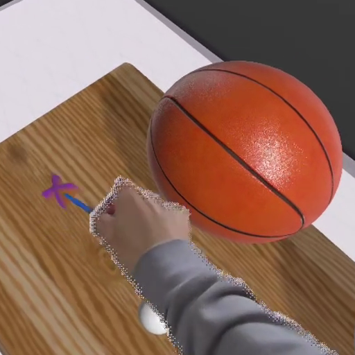
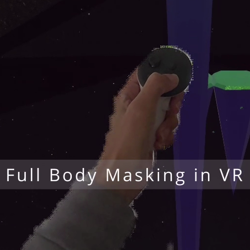

[GitHub](https://github.com/darktable) · [LinkedIn](https://linkedin.com/in/calvin-rien)

#### About Me
Senior Unity engineer specialising in mixed reality, real-time graphics, and mobile. I've shipped VR, AR, mobile, public installations, and console titles. Experience with: C#, URP, compute shaders, the C# Jobs System, debugging, optimisation, and CPU/GPU profiling.

### [Showcase Reel](https://www.youtube.com/watch?v=snbiQs3fDw8)

Some highlights from my past work. Ninja Turtles, The Marvelous Mrs. Maisel, LEGO, Meta, Coca-Cola, and more.

### [Sunbeams and shadows in XR on Meta Quest headsets](https://youtu.be/SnCxDkQVY5c)

A technique for bringing accurate directional sunbeams and their shadows into XR on Quest. This helps virtual objects feel more grounded in the room's actual light. Also built a tool to resize and extrude windows detected by Meta's room scan to improve sunbeam accuracy.

### [Full-body VR masking demo](https://www.youtube.com/watch?v=ABT1jUg3In4)

Egocentric Masking, a technique I developed to show your real body in VR instead of a pair of floating ghost hands. It uses the depth texture from Meta's Depth API and requires no body segmentation or computer vision overhead. I take advantage of the fact that a standing body sits inside a cylinder centred on your hips, extending out to your hands. I've found that body awareness improves comfort in VR. The VR Platforms experience used to make me nauseous, but this dramatically improves the experience.

#### APKs demonstrating full-body masking
You can sideload these onto your Quest 3 or 3S to try full-body masking in VR. You need to grant Scene permission to enable it.  
##### [Interaction SDK hand tracking and throwing sample](https://drive.google.com/file/d/1oqcUFugZwkt2LbMAdCcSIprBrY_WqOYu/view?usp=share_link)  
  
One of Meta's Interaction SDK samples with masking integrated. A safe and casual way to try out the feature.  
##### [VR Platforms](https://drive.google.com/file/d/1mXnLA1roPDAXHWjjGKXFiXmKplGmO_hE/view?usp=share_link)
  
A port of [Runevision's roomscale platforming prototype](https://github.com/runevision/vrplatforms). Navigate moving platforms without falling off. For the brave.

### Open source projects
#### [Phanto](https://github.com/oculus-samples/Unity-Phanto)
* Meta's official open-source mixed reality sample for Quest, and the public output of my time on Meta's XRTech team. I designed the "navmesh web" system that lets AI agents navigate room-scale environments, among other contributions. It shows how to build a game using Scene API's scene mesh and semantic tags.

#### [XR Gizmos](https://github.com/darktable/XRGizmos)
* An immediate-mode debug-drawing library for visualising geometry inside a VR headset, with an API that mirrors Unity's Gizmos. Adds useful primitives like arrows and cube grids. I use it in nearly every project, and it was adopted into Meta's Phanto sample for navmesh and agent-decision debug visualisation.

#### [SimpleJSON Fork](https://github.com/darktable/SimpleJSON)
* I'm the guy who shared the [MiniJSON script](https://gist.github.com/darktable/1411710) with the Unity community back in the day. I've stopped using MiniJSON and switched to SimpleJSON. This is my personal fork that's stricter than the original project (throws exceptions for bad behaviour). I also added some tests, Unity Pose type serialization, and some utility methods.

#### Contact
UK-based citizen with full right to work. Open to contract or full-time Unity/XR/Mobile roles, preferably remote or hybrid. Based in Horsham, within commuting distance of London, Brighton, and Guildford.
**[calvin.rien+gh2607@darktable.com](mailto:calvin.rien+gh2607@darktable.com)**

